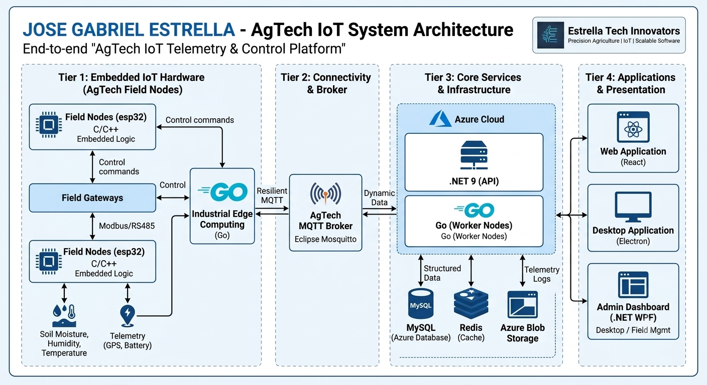

  

  <b>Software Architect | IoT & AgTech Innovator | Embedded Systems Specialist</b> 
  Dominican Republic

  <a href="https://linkedin.com/in/tu-perfil-de-linkedin">
    
  </td>
  

---

# 🌾 Bridging Software & Agriculture

<table border="0">
  <tr>
    <td width="35%" valign="top">
      
    </td>
    <td width="65%" valign="top">
      
I am a highly motivated software engineer specializing in merging high-level software architectures with low-level embedded hardware to create transformative solutions in <strong>Precision Agriculture (AgTech)</strong> and <strong>Industrial IoT (IIoT)</strong>.

      <ul>
        <li>
          <h4>⚡ Embedded & Real-time Systems</h4>
          
Programming microcontrollers (C/C++) and designing resilient telemetry systems.

        </li>
        <li>
          <h4>☁️ IIoT Connectivity</h4>
          
Implementing MQTT/HTTP/WebSockets for reliable data transmission from field devices.

        </li>
        <li>
          <h4>🖥️ Desktop & Web Solutions</h4>
          
Building comprehensive management platforms using .NET, Go, React, and Electron.

        </li>
      </ul>
    </td>
  </tr>
</table>
---

## 🧠 Continuous Self-Directed Engineering

> "I excel at rapid technological adaptation by interfacing directly with official documentation and implementing solution-driven architectures."

| Method | Execution & Philosophy |
| :--- | :--- |
| **Document-Driven Learning** | Mastering tools by consuming official specifications, RFCs, and engineering whitepapers directly, ensuring a deep technical understanding. |
| **Project-Based Execution** | Validating concepts through rapid prototyping and building production-ready code, solving real-world domain challenges in IoT and enterprise software. |
| **Technical Adaptability** | Swiftly acquiring new language stacks, communication protocols, and infrastructure paradigms to meet evolving project requirements. |

---

## 🛠️ Technical Capability Spectrum

### Languages & Primary Frameworks

| | | | |
| --- | --- | --- | --- |
|  C |  C++ |  C# |  Go |
|  .NET 9 |  React |  TypeScript |  JavaScript |

### IoT, AgTech & Embedded

| | | |
| --- | --- | --- |
|  Embedded C/C++ |  MQTT / Protocols |  ESP32 / Arduino |

### DevOps, Infrastructure & Data

| | | | |
| --- | --- | --- | --- |
|  Docker |  Git / GitHub |  Azure Cloud |  MySQL |

---

## 📈 High-Performance Metrics

  <!-- Contribution Graph - Muy estable -->
  

